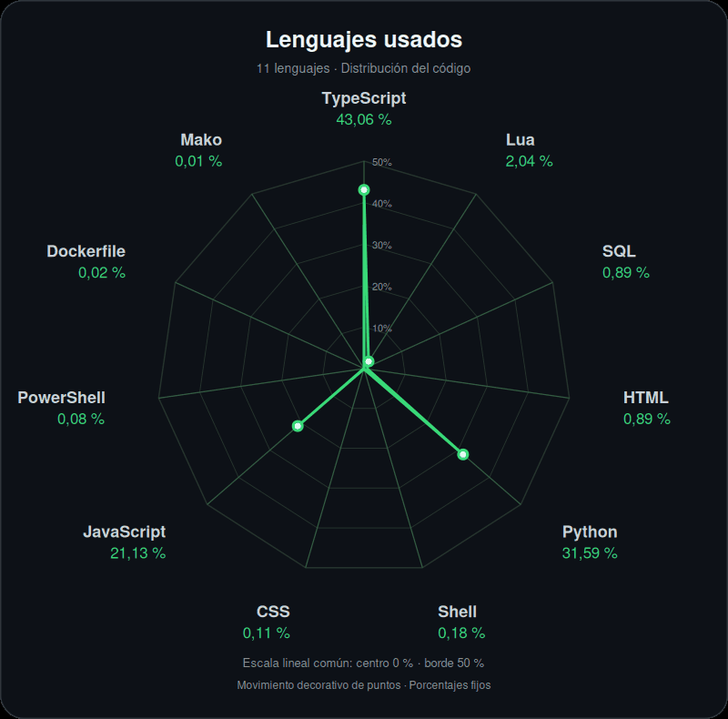

<h3 align="center">¡Hola! 👋 Soy Jhon Rubio</h3>

  <strong>Full Stack Developer | Plataformas web, automatización e IA</strong>

  Construyo plataformas web y herramientas de automatización, con un enfoque en
  <strong>interfaces claras</strong> y <strong>software confiable</strong>.
  Me gusta conectar el desarrollo de productos con soluciones que simplifican el trabajo.

---

### 🚀 Sobre mí

- 🌐 **Desarrollo web**: Trabajo en plataformas web y dashboards para negocios.
- ⚡ **Automatización**: Desarrollo herramientas y flujos para simplificar tareas.
- 🤖 **Inteligencia artificial**: Exploro asistentes de IA y la visualización de sistemas multiagente a través de mis proyectos.
- 🎨 **Interfaces**: Me enfoco en experiencias claras y funcionales con React, TypeScript y Tailwind CSS.
- 🛠️ **Actualmente**: Construyendo productos y compartiendo mis proyectos públicos a medida que están disponibles. Parte de mi trabajo es privado.

---

### 💡 Proyectos destacados

Construyo herramientas que conectan desarrollo web, automatización e inteligencia artificial.

#### 🤖 [OmniBot](https://github.com/RubioKo/omni-bot)

Bot de Discord de código abierto para **moderación, música y asistencia con IA**.

Python · discord.py · SQLite · FastAPI

#### 🐝 [HiveScope](https://github.com/RubioKo/hivescope)

Visualización de **sistemas de IA multiagente**, con un enfoque local-first. Actualmente en fase alfa.

React · D3.js · WebSockets · Python

#### 🔒 Desarrollo privado

Parte de mi trabajo vive en repositorios privados: **plataformas web, dashboards para negocios y flujos de automatización**. Desarrollo interfaces, servicios y herramientas que simplifican tareas y convierten ideas en productos funcionales.

---

### 🛠️ Tech Stack

#### ⚙️ Backend & Bases de datos

#### 💻 Frontend & UI

#### 🧰 Infraestructura & Herramientas

---

### 📊 Lenguajes usados

  

Ver porcentajes exactos

| Lenguaje | Porcentaje |
| :--- | ---: |
| TypeScript | 43,06 % |
| Python | 31,59 % |
| JavaScript | 21,13 % |
| Lua | 2,04 % |
| SQL | 0,89 % |
| HTML | 0,89 % |
| Shell | 0,18 % |
| CSS | 0,11 % |
| PowerShell | 0,08 % |
| Dockerfile | 0,02 % |
| Mako | 0,01 % |

Distribución agregada del código en mis repositorios accesibles, públicos y privados, calculada por tamaño de archivos según su extensión. Incluye lenguajes web, plantillas y Dockerfile; excluye dependencias, salidas de compilación y archivos de datos. Refleja el código actual, no el historial completo ni el nivel de dominio. Actualizado: 5 de octubre de 2026.

---

### 📫 Conectemos

¿Tienes una idea o quieres contribuir? Explora mis repositorios o abre un issue en el proyecto correspondiente.

  
  
  

  
   
  Escanea el QR o haz clic para conectar conmigo en Instagram.

